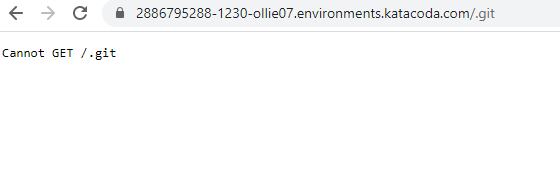
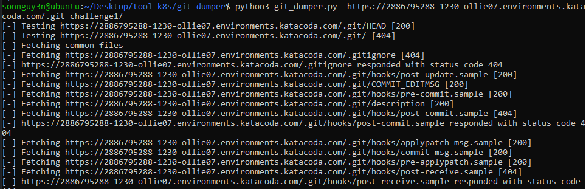
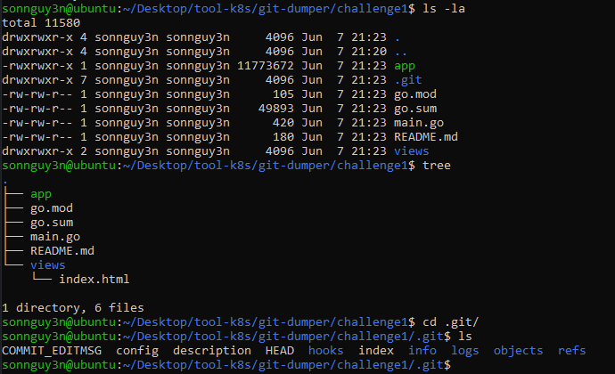
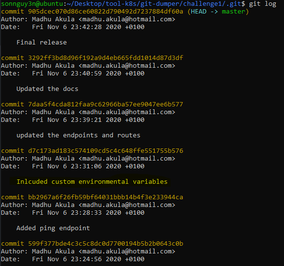
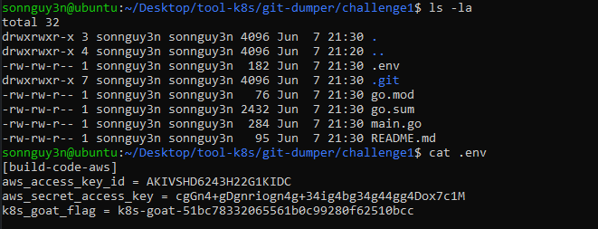

# Sensitive keys in codebases

Kịch bản này xảy ra khi mà một developer commit project lên git mà không xóa đi các thông tin nhảy cảm về hệ thống. Có thể tồn tại các secret key của Cloud, hay thông tin về hệ thống, username, password...
Trường hợp này xảy ra ở môi trường thực tế rất nhiều nên các bạn cũng cần phải chú ý nhé.

# Solution

Bước 1: Chạy các tool recon như dirsearch, gofuzz,.. và phát hiện ra endpoint `.git`



Bước 2: Chạy tool `git-dumper.py` để clone các thông tin từ `.git` về



Bước 3: Kiểm tra các info thu thâp được

Thông tin folder



Kiểm tra `log commit` của git

```sh
git log
```



Để ý thấy có commit `d7c173ad183c574109cd5c4c648ffe551755b576` với comment ` Inlcuded custom environmental variables`. Kiểm tra commit đó bằng cách:

```sh
git checkout d7c173ad183c574109cd5c4c648ffe551755b576
ls -la
cat .env
```



Xong.

# Lưu ý:

Target vào môi trường cloud nên hãy cố gắng kiếm các serect_key của cloud trong các thông tin thu thập được.

Hãy kiểm tra các `commit log` vì có thể developer đã commit các thông tin nhạy cảm lên nhưng đã commit lại.
