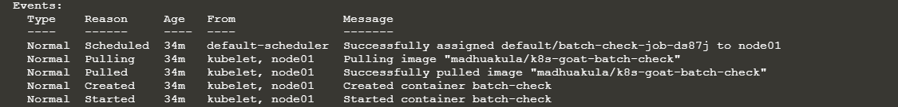

# Analysing crypto miner container

( _Nghiên cứu thêm về các kỹ thuật phân tích docker image? Cách control images trên máy node từ máy master?_ )

Trường hợp này không chỉ đối với cryto miner mà còn có thể áp dụng phân tích các image độc hại khác. Môi trường k8s là một môi trường dễ tấn công bởi vì bạn rất ít khi kiểm tra images được build như thế nào và nó đang chạy những gì.

Kịch bản này là một case giúp chúng ta phát triển quá trình nhận ra các images độc hại.

# Solution

Để bắt đầu, tiến hành kiểm tra tất cả các imagse/resource trong cluster, kể các `jobs`


Có thể thêm option `-o wide` để có nhiều thông tin hơn


Sau khi đã kiểm tra thông tin jobs, để có thể xác định `job` đang chạy ở `pods` nào, sử dụng command sau để lấy thông tin `pod`:

Xác định pod:

```sh
kubectl describe job batch-check-job
```


Lấy thông tin pod manifest :

```sh
kubectl get pod batch-check-job-ds87j -o yaml
```


Kiểm tra thông tin `pod`:



Ở đây, chúng ta có thể thấy `pod` này sử dụng `madhuakula/k8s-goat-batch-check`. Tiến hành phân tích docker image trên.

```sh
docker history --no-trunc madhuakula/k8s-goat-batch-check
```
