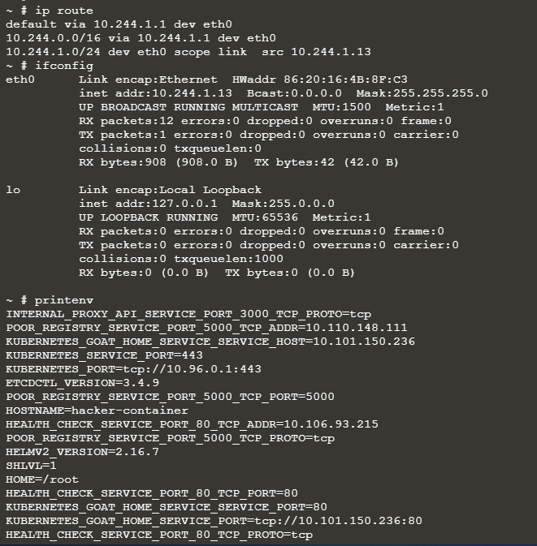
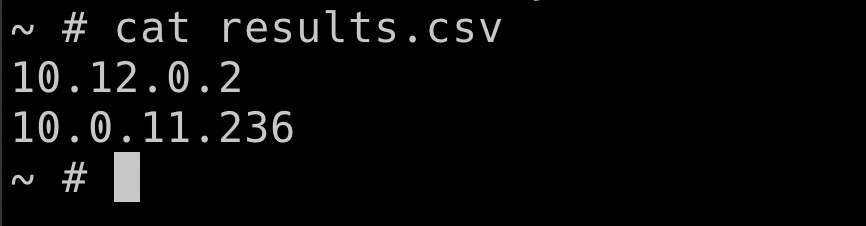
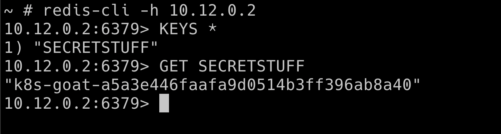

# Kubernetes Namespaces bypass

Mặc định, k8s cluster sử dụng một mạng ngang hàng, nghĩa là các pods/service trong cluster đều có thể giao tiếp với nhau. Kể cả namespace mặc định cũng không có bất kỳ ràng buộc chặt chẽ nào về network Vì vậy, bất kì một pod/service nào trong namespace này cũng có thể giao tiếp với pod/service ở namespace khác.

Giả sử chúng ta đã compromise được một container trong mạng.

# Solution

Đầu tiên, điều tra xác định thông tin mạng trên máy( container) vừa compromise

```sh
ip route
ifconfig
printene
```



Sau khi có thông tin cơ bản, tiến hành scan của subnet 10.0.0.0/8 ( kịch bản là cluster đang sử dụng default network), sau scan phát hiện một service đang chạy ở port `6379` -> Redis



## Khai thác

Kết nối tới Redis service

```sh
redis-cli -h 10.12.0.2
KEYS *
GET SECRETSTUFF
```



Có thể thấy rằng, Redis không cần authen cũng có thể connect được và attacker có thể khai thác được các thông tin nhạy cảm trên service này.

# Kết luận

Với các cluster sử dụng network default, các namespace không có khả năng ngăn chuyện việc communicate giữa chúng. Vì vậy, như bạn có thể compromise một container, hãy thử scan cả subnet để đảm bảo không bị miss case nào.
Ngoài ra, không chỉ mỗi Redis mà có rất nhiều `service` do nghĩ chạy trong `internal` sẽ không có xác thực. Vì vậy, nếu `recon` tốt, sẽ có khả năng khai thác hệ thống nhiều hơn.
