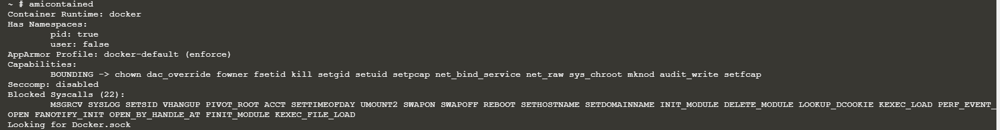
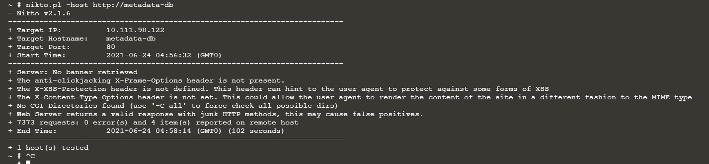

# Hacker Container preview

Ở kịch bản này sẽ chỉ cho bạn các công cụ hỗ trợ khi bạn pentest một k8s cluster. Giả sử bạn đã chiếm được một containter trong mạng, hãy sử dụng các công cụ dưới đây để kiểm tra các thông tin cần thiết để có thể tiến hành khai thác được sâu hơn.

# Solutoin

```sh
amicontained
```
`amicontained` cho phép bạn kiểm tra xem container runtime đang sử dụng là gì cũng như các tính năng đang có sẵn trên container mà bạn được phép sử dụng.

 

Như trên hình, `amicontained` detect ra container runtime đang sử dụng là `docker` cũng như các `Capabilities` được phép acess trong container. Từ đây, có thể tìm được hướng khai thác phù hợp.

Tiếp theo, công cụ scan `nikko`

`Nikko` là một web service scaner. Tùy vào các trường hợp khác nhau mà bạn có thể lựa chọn các công cụ scanning khác cho phù hợp.


 

# Kết luận

Không khác gì so với việc bạn recon network thông thường.