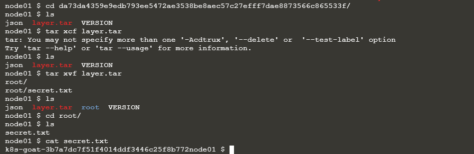

# Hidden in layers

`Sensitive information disclosure` là một trong những lỗ hổng tồn tại phổ biến nhất trên internet. Xử lý sai password, private keys, token trên container rất dễ mắc phải. Trong kịch bản này, tác giả đã đưa ra một số `bad practice` dẫn tới việc `Sensitive information disclosure`.

# Solution

Tiến hành phân tích một `pod` đang chạy, ở đây là `hidden-in-layers `


Như đã phân tích ở `challenge 10`, để kiểm tra thông tin `pod`, sử dụng command:

```sh
kubectl describe pod hidden-in-layers
```

hoặc

```s
kubectl get pods -o wide 
```


Biết được image sử dụng ở đây là `madhuakula/k8s-goat-hidden-in-layers`. Ta kiểm tra thì thấy pods này đang chạy trên `node01`. 
```sh
ssh root@node01
```
Để tiến hành phân tích `image` này. Cũng như `describe` của `kubectl`, Docker cũng có một tính năng tương tự đó là `inspect`. Sử dụng nó để kiểm tra tổng quan image:

```sh
docker inspect madhuakula/k8s-goat-hidden-in-layers 
```


Sau khi inspect, ta thu thập được một vài thông tin như mà `command` được thực thi khi container khởi chạy. Nhưng không có thông tin gì nhạy cảm ở đây cả. Để có thể tiến hành phân tích chi tiết hơn, chúng ta cần xem xét `image` này được build như thế nào. Nếu bạn đã có `Dockerfile` của image này, quá tốt chỉ cần đọc nó. Nếu không, chúng ta có vài cách để có thể tái tạo lại `Dockerfile` cho image này.

## Method 1: Sử dụng docker history

```sh
docker history --no-trunc madhuakula/k8s-goat-hidden-in-layers
```


Ở đây, chúng ta có thể thây được các lịch sử mà image tạo thành. Cũng từ đó có thể suy ra được `Dockerfile` sử dụng. 

## Method 2: generates dockerfile from image

`alpine/dfimage` tạo `Dockerfile` của bất kỳ image nào. Đặt `alias` cho container này.

```sh
alias dfimage="docker run -v /var/run/docker.sock:/var/run/docker.sock --rm alpine/dfimage"
```

Sau đó, thực hiện command dưới đây để tạo `Dockerfile` cho bất kỳ image nào bạn muốn.

```sh
dfimage -sV=1.36 madhuakula/k8s-goat-hidden-in-layers
```


Có thể thấy, `Dockerfile` được generate từ Method này gần tương tự như method 1.

## Method 3: Dive

`Dive` (https://github.com/wagoodman/dive) là một công cụ tuyệt vời để giúp bạn phân tích các layer của images.

```sh
dive madhuakula/k8s-goat-hidden-in-layers
```


Từ tất cả các cách phân tích trên, chúng ta có thể thấy image có một số thay đổi đáng chú ý ở 2 file `root\secret.txt` và `root\contributor.txt`. Các phương pháp trên chỉ giúp chúng ta biết thông tin về Dockerfile chứ không thể đọc nội dung tệp tin. Để đọc được nội dung các file trên, tiến hành kiểm tra:

Khởi chạy image bằng `docker` hoặc `kubectl`:


`secret.txt` không tồn tại tại container hiện tại vì nó đã được delete trong quá trình build image ( `Dockerfile`). Sử dụng dockercli tiến hành export images ra `tar` file.

```sh
docker save madhuakula/k8s-goat-hidden-in-layers -o hidden-in-layers.tar
# Extract
tar xvf hidden-in-layers.tar
```


Sau khi export ra chúng ta thấy images có 3 layer, mỗi layer ứng với một file `tar`. Vì chỉ có 3 layer nên chúng ta có thể manual để tìm ra file `secret.txt`. Tuy nhiên, đây không phải là cách thường dùng, bởi giả sử chúng ta có hơn `100 layer` thì manual không phải là cách tối ưu. Để xử lý trường hợp này, hãy sử dụng `dive` như ở method 3.


Có thể thấy tìm thấy file `secret.txt` ở layer này, với `id` là `da73da4359e9edb793ee5472ae3538be8aec57c27efff7dae8873566c865533f`. Thoát ra là tìm tới file `tar` với id trên để tìm file `secret.txt`.

