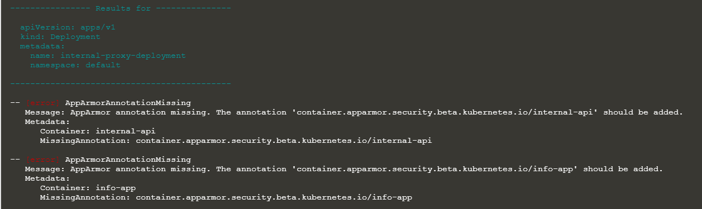

# KubeAudit - Audit Kubernetes Clusters

Kịch bản này được xây dựng để thực hiện audit/scan K8s Cluster xem có các lỗ hổng bảo mật, rủi ro khác hay không bằng KubeAudit.

Để bắt đầu, chạy lệnh sau để start hacker-container với các đặc quyền của quản trị viên cụm (chẳng hạn như tiller service account)

```sh
kubectl run -n kube-system --serviceaccount=tiller --rm --restart=Never -it --image=madhuakula/hacker-container -- bash
```

# Solution

`kubeaudit` là một công cụ command giúp việc audit k8s cluster với một số lỗi, rủi ro điển hình sau:

- run as non-root

- use a read-only root filesystem

- drop scary capabilities, don't add new ones

- don't run privileged

- and more!

```
Vui lòng đọc https://github.com/Shopify/kubeaudit để hiểu chi tiết hơn
```

Chạy kubeaudit ở cluster mode. `Kubeaudit` có thể phát hiện nó đang chạy trong một container của cluster và cố gắng `audit` tất cả các resource trong cluster đó.

```
kubeaudit all
```


