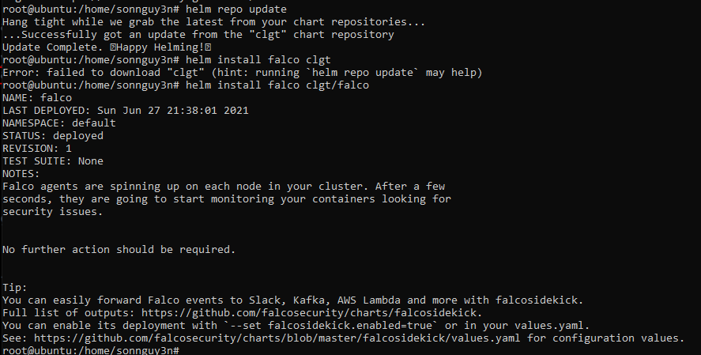
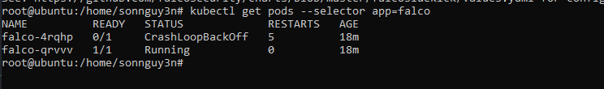
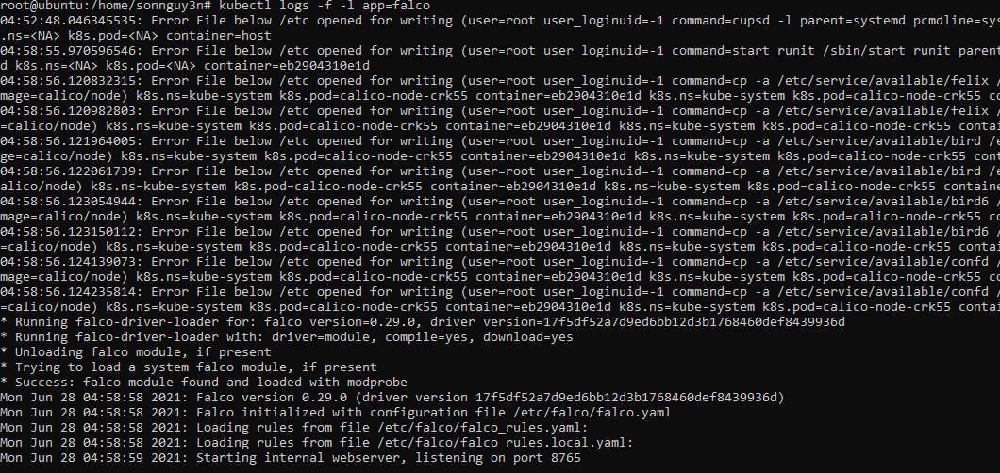

# Sysdig Falco - Runtime Security Monitoring & Detection

Kịch bản này hướng dẫn các bạn triển khai một `security & detection` cho tài nguyên container và k8s cluster.
Để bắt đầu, bạn cần deploy các `chart` dưới đây với helm 3.

```
helm repo add falcosecurity https://falcosecurity.github.io/charts
helm repo update
helm install falco falcosecurity/falco
```


# Solution

`Falco` là một dự án ` cloud-native runtime security `, nó là một công cụ `Kubernetes threat detection` . Falco được tạo ra bởi Sysdig vào năm 2016 và là  một dự án `runtime security` đầu tiên tham gia CNCF với tư cách là một dự án `incubation-level`. `Falco` phát hiện hành vi lạ từ các ứng dụng trên các pod và cảnh báo chúng.

`Falco` sử dụng system call để bảo mật và giám sát hệ thống:

- Phân tích các Linux system call từ kenerl trong thời gian thực ( at runtime)
- Asserting the stream against a powerful rules engine
- Cảnh báo khi vào rule bị vi phạm

`Falco` sử dụng một bộ rule mặc định để kiểm tra `kernel` với các hành vi bất thường ( `unusual behavior`), chẳng hạn như:

- Nâng quyền dựa trên các `privileged containers`
- Thay đổi namespace khi sử dụng các công cụ như `setns`
- Read/write vào các thư mục well-known như `/etc, /usr/bin, /usr/sbin, etc`
- Khi tạo một symlink ( create symlink)
- Thay đổi `Ownership và Mode`
- Network connection hoặc socker có thay đổi
- Tạo process từ `execve`
- Thực thi các shell binary như `sh, bash, csh, zsh, etc`
- Thực thi các SSH binary như `ssh, scp, sftp, etc`
- Gây ảnh hưởng tới các `Linux coreutil`
- Có thay đổi trên `login binary`
- Có thay đôi trên các `shadownutil hay passwd` executetable như `adowconfig, pwck, chpasswd, getpasswd, change, useradd, etc, and others`


Lấy thông tin từ `falco deployment`

```sh
kubectl get pods --selector app=falco
```



Lấy nhật ký từ hệ thống falco theo cách thủ công

```sh
kubectl logs -f -l app=falco
```



Bây giờ, hãy thử khởi chạy một container và `cat` một file nhạy cảm để xem thử `Falco` có thể detect được hành vi này hay không.

```sh
kubectl run --rm --restart=Never -it --image=madhuakula/hacker-container -- bash
```

`To be continue...`