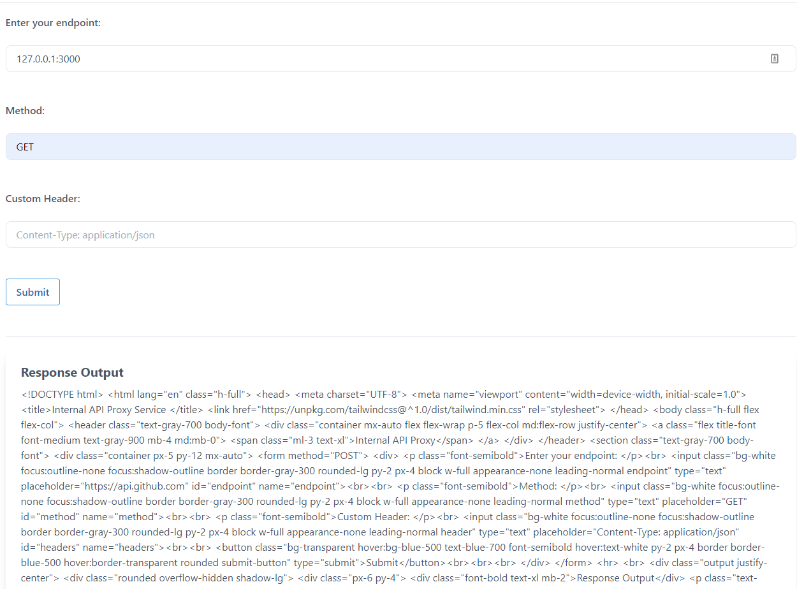
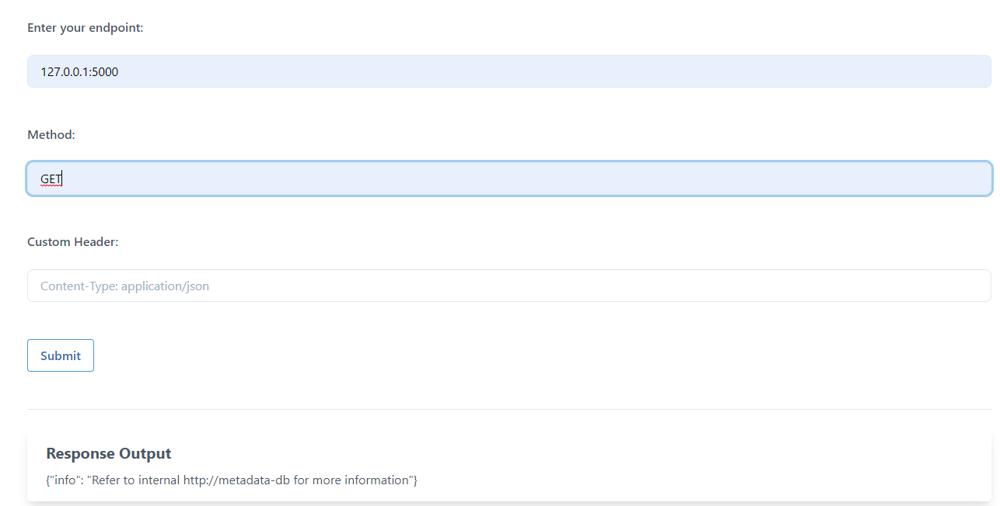

# SSRF in K8S world

Lỗ hổng SSRF trên môi trường cloud làm một thứ gì đó vô cùng nguy hiểm. Attaker có thể lấy được những metadata nhạy cảm, có thể RCE server.

# Solution

Ứng dụng bị lỗ hổng SSRF dẫn tới việc attacker có thể tìm kiếm các service đang chạy trong mạng nội bộ, ví dụ như:

Scan được một service chạy ở port 3000. Tiếp tục tìm kiếm... và phát hiện một service khác

Dựa vào response phản hồi, chúng ta có thể biết được service này đang communicate với một service đang chạy đó là `http://metadata-db`, với schema là http chúng ta hoàn toàn có thể access tới được.

Tuy nhiên do có thể trong quá trình setup hay sao đó có thể không access tới được `metadata-db` nên chúng ta không có thêm thông tin. Trong thực tế cũng vậy, hãy tìm kiếm các service, server nội bộ khác để exploit.
