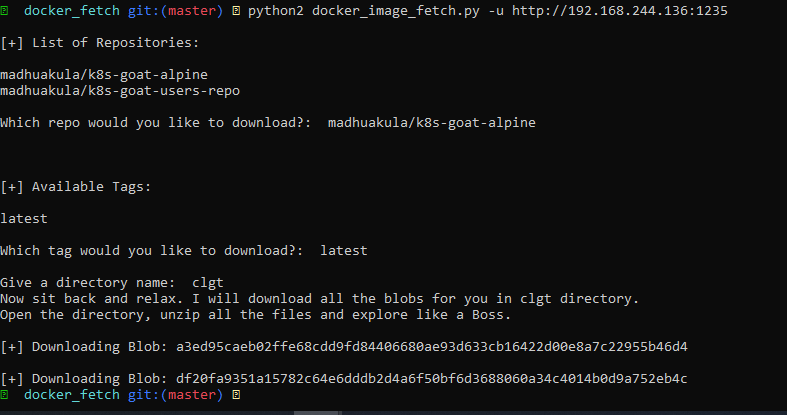
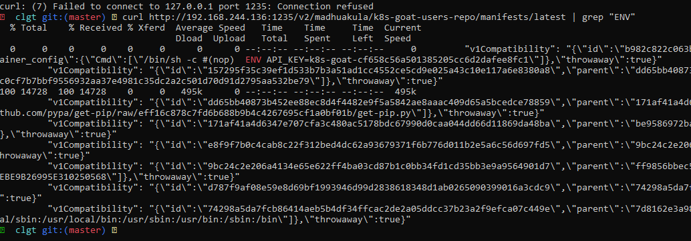

# Attacking private registry

Container registry là một nơi để chứa tất cả các image của công ty, tổ chức lên đó. Thường thì các công ty đều sẽ cố một Registry riêng để lưu trữ các images nội bộ của công ty. Tùy vào cấu hình mà nó sẽ được private hay public. Tuy nhiên, việc cấu hình sai thường xuyên diễn ra ở Container Registry ( chẳng hạn như không authenticate). Do là vì nơi lưu trữ images nội bộ nên các images thường chứa rất nhiều các thông tin nhạy cảm. Có thể ảnh hưởng rõ tới công ty.

# Solution

Đâu tiên, sau khi scan được ip:port lạ, truy cập vào thử:


Trắng tinh, không có gì. Tuy nhiên, đến đây thường pentester sẽ sử dụng `dirsearch` để tìm ra các endpoint lạ. Chạy `dirsearch` và phát hiện ra các `api` khả nghi.

```sh
curl http://127.0.0.1:1235/v2/
curl http://127.0.0.1:1235/v2/_catalog
```


Đến đây, có thể xác định rằng đây là một container registry. Tìm kiêm và sử dụng https://github.com/NotSoSecure/docker_fetch.git để craw hết các images về để tìm các thông tin nhạy cảm có thể khai thác được.



Hoặc có thể đọc các file manifest để tìm các thông tin nhạy cảm trước như các biến môi trường `ENV, KEY_API`

```sh
curl http://192.168.244.136:1235/v2/madhuakula/k8s-goat-users-repo/manifests/latest | grep "ENV"
```



_NOTE:_ Hướng nghiên cứu sử dụng API_KEY như thế nào?
