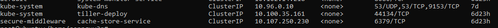

# Helm v2 tiller to PwN the cluster

(_Cần research thêm về case này_)

Helm là một package manager của K8s. Kịch bản này xảy ra với các hệ thống k8s sử dụng Helm v2, Tiller service với RBAC mặc định có thể chiếm quyền truy cập trên K8s cluster.

# Solution

Đầu tiên, mô hình của Helm cũng giống docker và k8s đó là client và server. Ở đây, Helm với các command để các bạn tương tác là client, còn server sẽ được gọi là Tiller. Tùy vào quản trị viên mà cách deploy helm cũng sẽ khác nhau, có thể chạy `trong K8s cluster` cũng có thể được cài đặt ở `local`.

**Quan trọng**: Tiller service chạy ở port `44123`

Tiller chạy trên k8s cluster:


Service port của `Tiller`:



Nếu bạn scan hoặc phát hiện có port `44123` hãy tiến hành kiểm tra nó ngay lập tức.

## TEST

Thử kết nối tới service đang chạy

```sh
# Thay tiller-deploy.kube-system nếu expose ra ngoài internet
telnet tiller-deploy.kube-system 44134

```

```sh
# Check version
helm --host tiller-deploy.kube-system:44134 version
```

Đến đây, nếu có phản hồi hãy research để khai thác nó. Chẳng hạn như deploy một `pods` mới với `helm`, hay truy cập các thông tin trong `secrets`. Kiểm soát toàn bộ hệ thống k8s cluster.

# Kết luận

Cần phải nghiên cứu về helm nhiều hơn để hiểu bản chất của rủi ro này và cách khai thác chi tiết hơn. Trong kịch bản, tác giả có kết luận:

```
This scenario varies how the tiller deployment has been performed, sometimes admins deploy tiller to a specific namespace with specific privilege. Also from Helm version 3, there is no tiller service to mitigate such vulnerabilities
```

Có nghĩa là lỗi này có thể xảy ra trong việc `quản trị viên` triển khai `Tiller` với các đặc namespace và đặc quyền cao.
