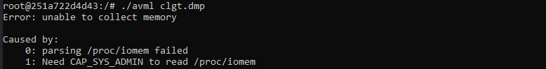
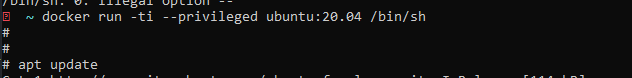
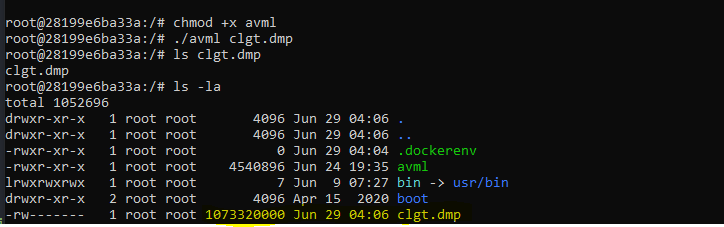

# Dump memory in container Docker

## Requirement 

1. https://github.com/microsoft/avml

```sh
wget https://github.com/microsoft/avml/releases/download/v0.3.0/avml
```

## Dump memory

```sh
chmod +x avml
avml memory.dmp
```
## Issue 

Đầu tiên, `container` sử dụng chung memory với `HOST`. Dẫn tới nếu dump `memory` trong `container` sẽ gặp tình trạng này.



***Solution 1***: Chạy `container` full quyền với option `--privileged`



DUMP



*Kết luận: Dump như này cũng là dump nguyên memory của host luôn. Vậy không có ý nghĩa*

***Solution 2***: https://github.com/checkpoint-restore/criu

Không đúng như yêu cầu là dump only memory của container nhưng đây cũng là 1 cách để 